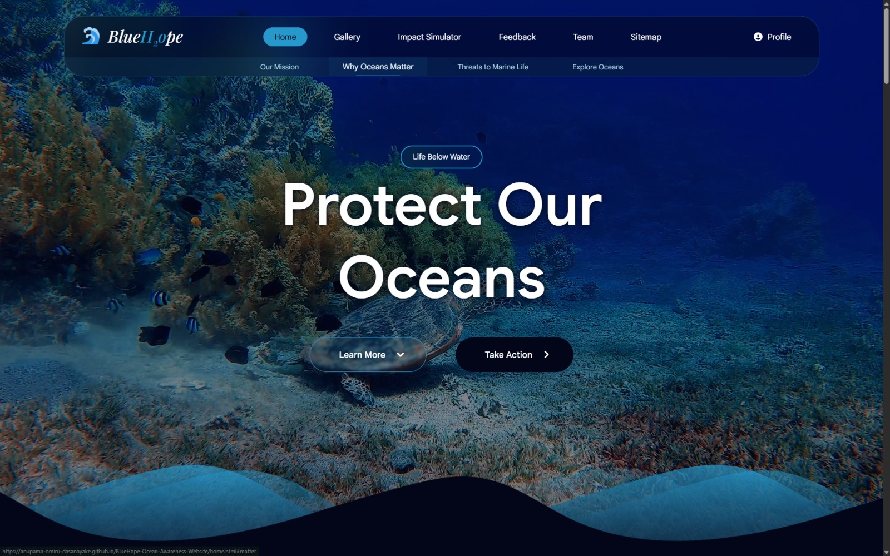
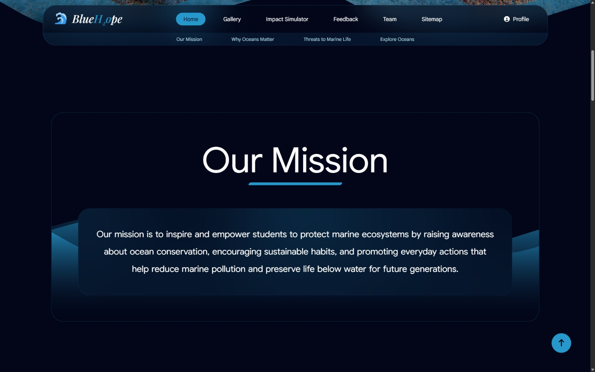
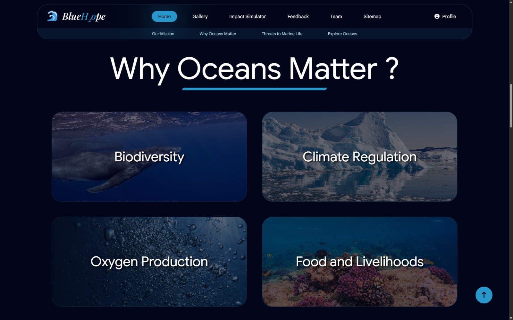
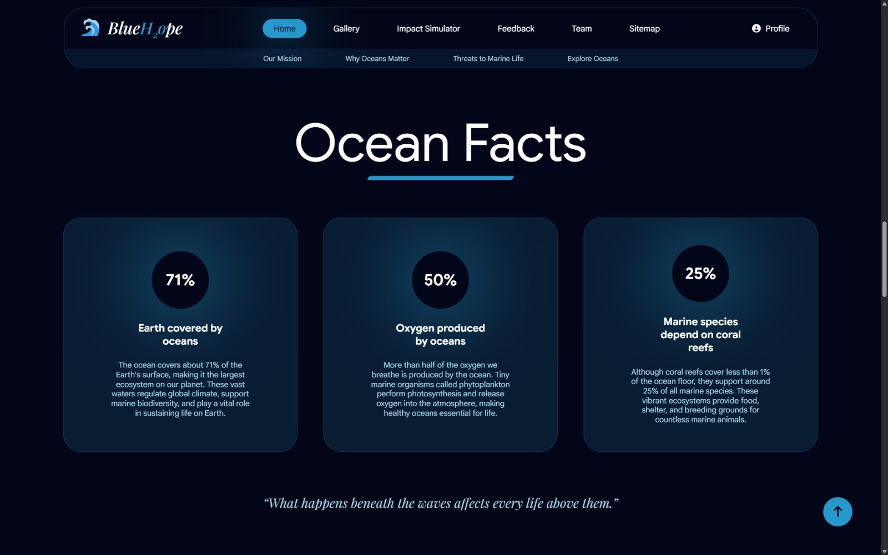
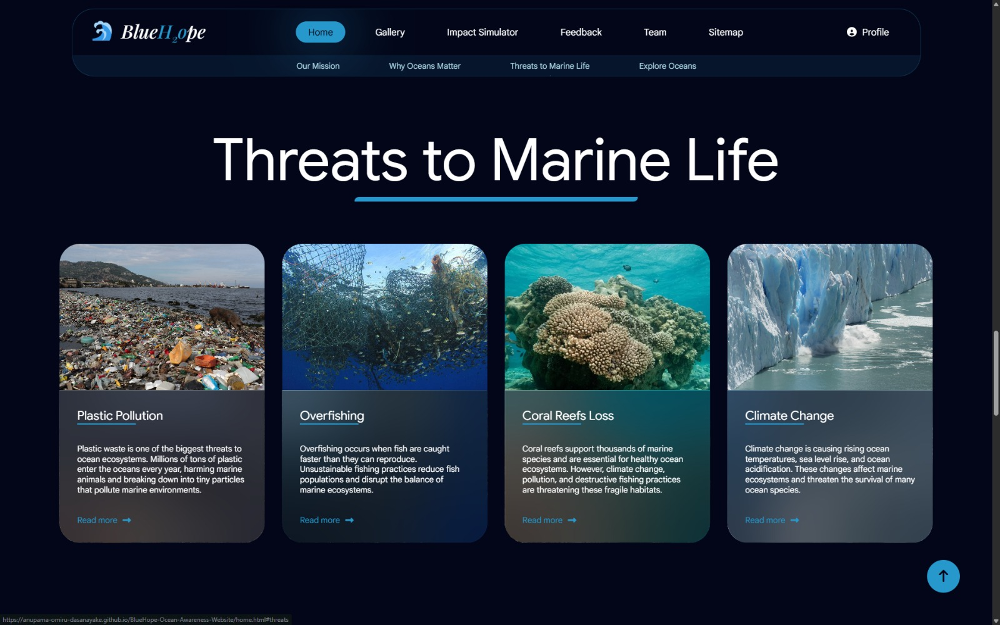
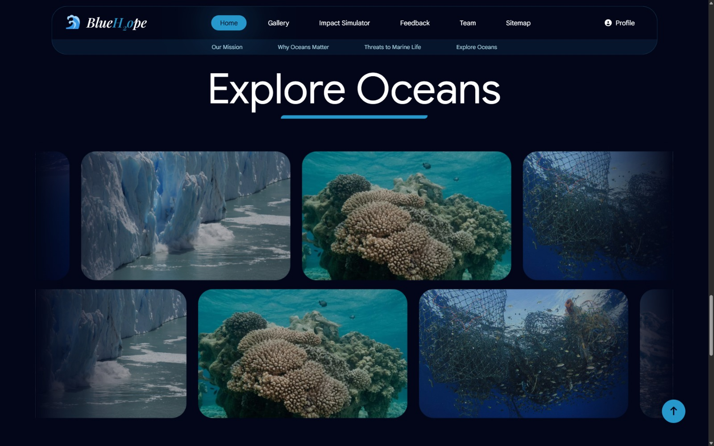
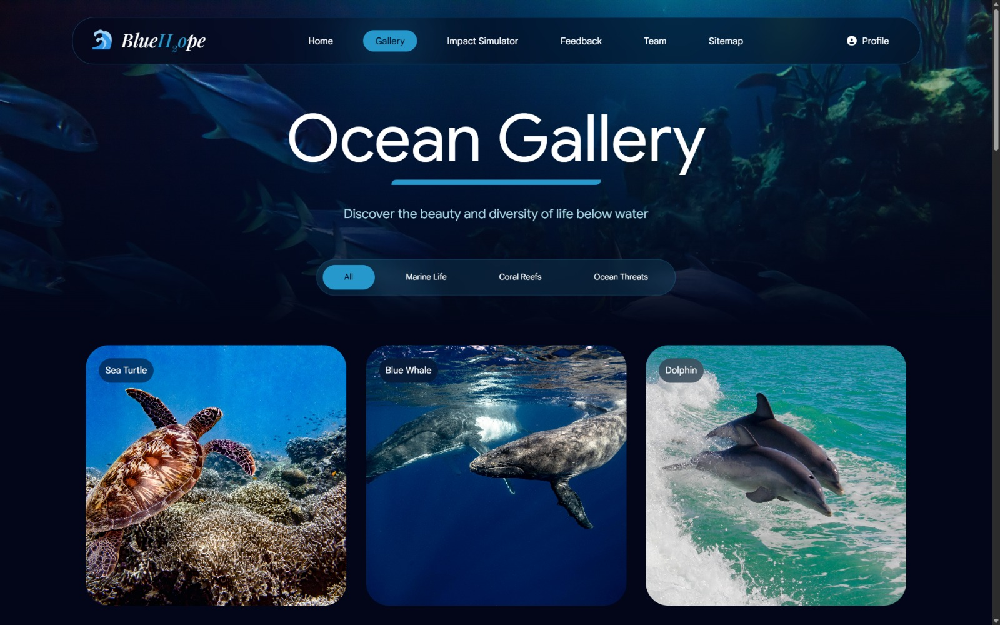
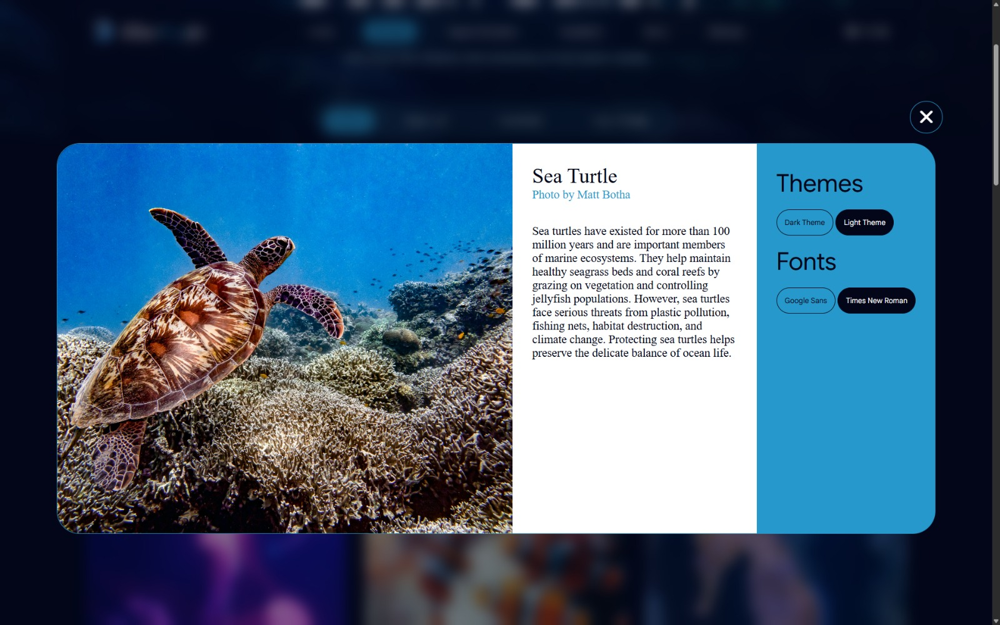
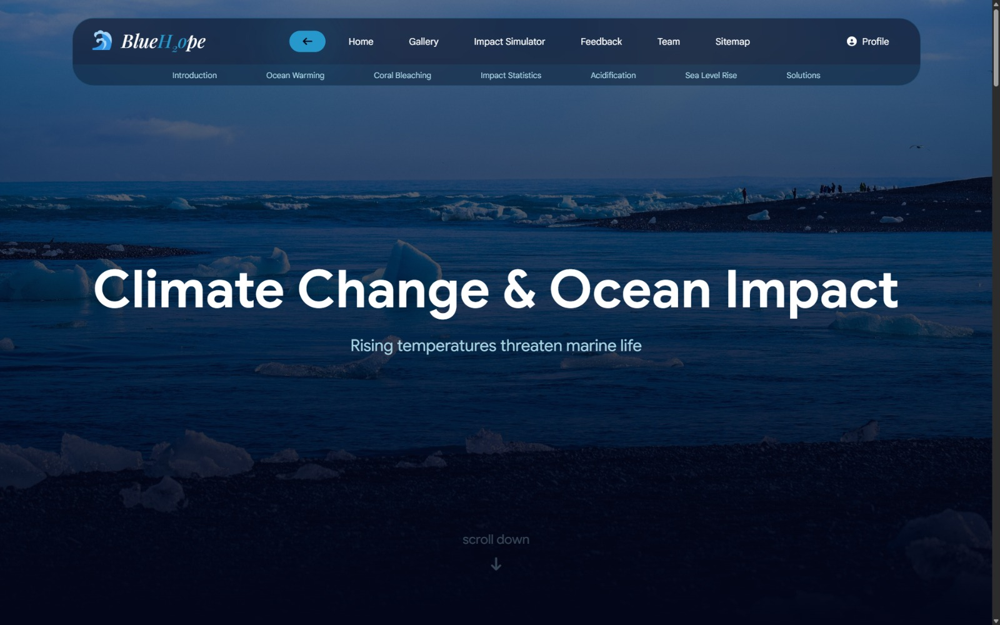
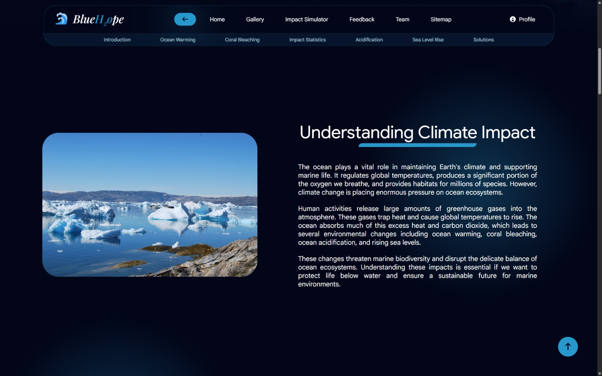

# BlueHope
### SDG 14 – Life Below Water Awareness Website

BlueHope is a multi-page educational website developed as part of a **University of Westminster Web Design and Development group coursework project**.  

The project focuses on **Sustainable Development Goal 14 – Life Below Water**, aiming to raise awareness about ocean conservation, marine pollution, and climate impacts on marine ecosystems.

The website provides educational content, interactive features, and visual resources to encourage individuals to understand and take action to protect ocean environments.

---

# Project Overview

The goal of the BlueHope website is to inform users about marine environmental challenges and inspire practical actions that help protect ocean ecosystems.

The website includes:

- Educational content about ocean issues
- Interactive components and visual media
- Multi-page navigation structure
- Responsive web design
- User interaction features built with JavaScript

The project was developed collaboratively by a team of **four students**.

---

# My Role – Project Lead

I served as the **Project Lead (Student 1)** and was responsible for building the **technical foundation and several core pages of the website**.

### My Responsibilities

- Led and coordinated the development of the group website
- Implemented the **shared website template**
- Designed and built the **global navigation bar**
- Developed the **global CSS styling system**
- Created the **Home Page**
- Developed the **Gallery Page with JavaScript interactivity**
- Created my **individual Climate Impact content page**
- Coordinated integration of all team members’ pages
- Managed overall website consistency and structure

The shared template and global CSS ensured **visual consistency across all pages developed by the team**.

---

# Pages Implemented by Me

| Page | Description |
|-----|-------------|
| Template | Shared HTML structure used by all pages |
| Global CSS | Centralized styling system used by the entire website |
| Home Page | Main entry page introducing the website mission |
| Gallery Page | Interactive image gallery with JavaScript functionality |
| Content Page (Student 1) | Climate impact on oceans educational page |

---

# Features

- Responsive multi-page website
- Shared **HTML template and navigation system**
- **Global CSS styling system**
- Interactive **JavaScript image gallery**
- Educational content related to **SDG 14**
- Internal navigation and structured page layout
- Accessible design with semantic HTML
- Interactive UI components

---

# Technologies Used

- HTML5
- CSS3
- JavaScript
- Responsive Web Design
- DOM Manipulation
- UI/UX Design Principles

---

# Project Structure

```
BlueHope/
│
├── home.html
├── gallery.html
├── splash.html
├── ais.html
├── feedback.html
├── team.html
├── profile.html
├── sitemap.html
│
├── content_ST1.html
├── content_ST2.html
├── content_ST3.html
├── content_ST4.html
│
├── pageEditor_ST1.html
├── validation_ST1.html
│
├── pageEditor_ST2.html
├── validation_ST2.html
│
├── pageEditor_ST3.html
├── validation_ST3.html
│
├── pageEditor_ST4.html
├── validation_ST4.html
│
├── style.css
├── script.js
│
├── video/
└── img/
```

---


# Website Preview

### Home Page







### Gallery Page



### Climate Impact Content Page




---


# Learning Objectives

This project demonstrates key front-end development skills including:

- Creating **structured multi-page websites**
- Separating **structure (HTML), styling (CSS), and behaviour (JavaScript)**
- Building **interactive web interfaces**
- Implementing **reusable templates and shared styles**
- Collaborating in a **team-based development environment**

---

# About SDG 14 – Life Below Water

Sustainable Development Goal 14 focuses on **conserving and sustainably using oceans, seas, and marine resources**.

This project explores topics such as:

- Plastic pollution
- Overfishing
- Climate change impacts on oceans
- Coral reef destruction

BlueHope aims to **educate and inspire users to take actions that protect marine ecosystems**.

---

# Academic Context

This website was developed as part of the **Web Design and Development module coursework at the University of Westminster**.

Students were required to:

- Work in groups
- Develop a multi-page website
- Implement individual assigned pages
- Demonstrate HTML, CSS, and JavaScript skills
- Present and defend their contributions during an in-class demonstration.

---

# License

This project was developed for **educational purposes only** as part of a university coursework assignment.

